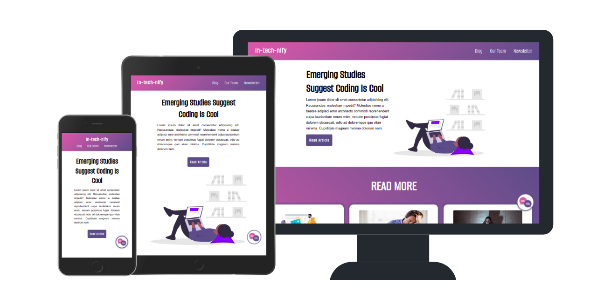

<h1 align="center">HTML & SASS Front End Project</h1>

## 📖 About

This was one of the first projects I built at Integrify. The task was building and styling a template for a blog, and it aimed to teach best practices for a more accessible front-end, as well as give us a chance to practice SASS and animation.

## ✨ Focus Points

- **Accessibility** (i.e. Semantic HTML, ARIA attributes, image alts )
- **Responsiveness**
- **Animation**

## 🔧 Built With

- **HTML**

## 🖌️ Styled With

- **SASS**
